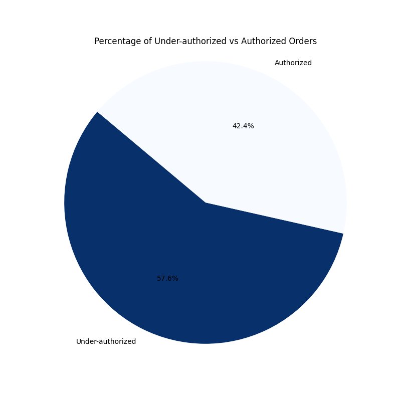
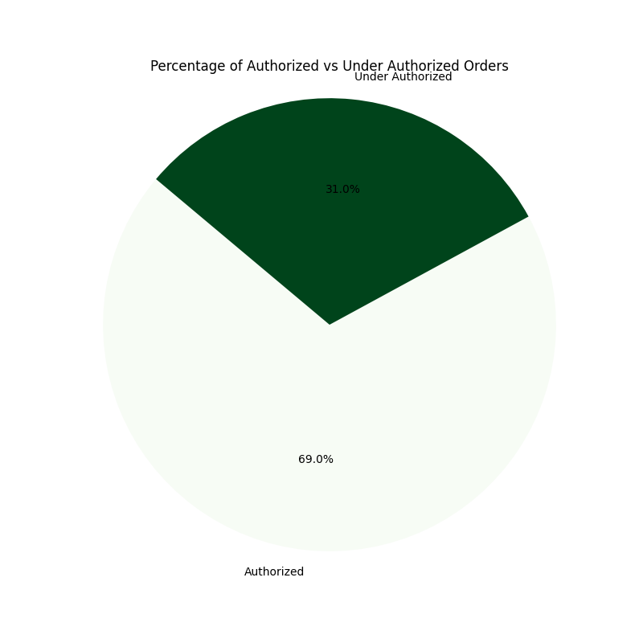
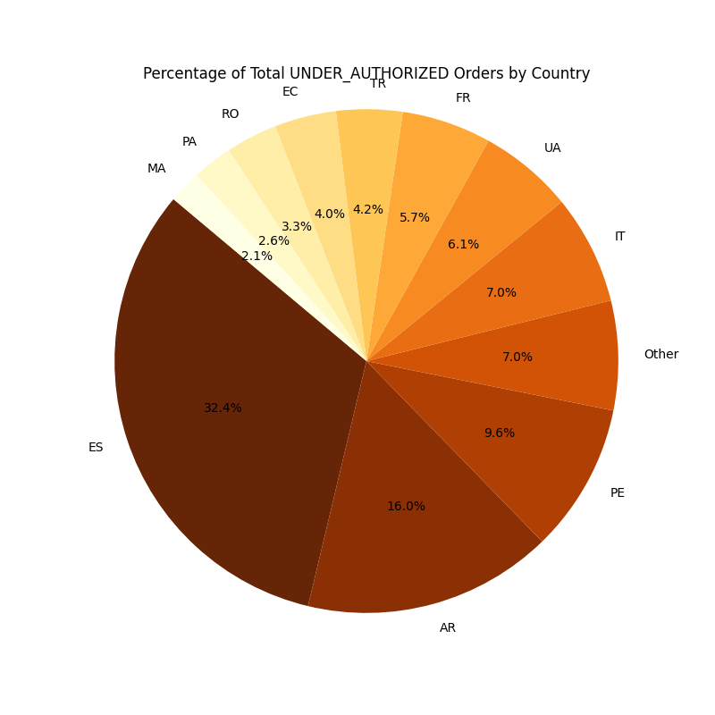
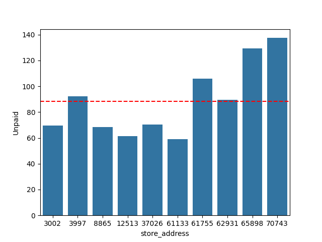
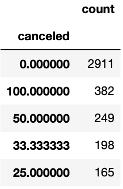

# Exploratory Data Analysis (Statistical Programming Exercise)

# CANVA PRESENTATION:

https://www.canva.com/design/DAF9c0mTDVo/DyIDLjrwWQpJL0BKiT-0UA/edit

## 1. Introduction
This repository contains a Python script for performing exploratory data analysis (EDA) on a dataset of orders coming from Fake partners in an app. Fake partners are stores not directly integrated with the delivery app, so the content team manages their product catalog and prices. The dataset includes information such as order ID, activation time, country code, store address, final status, payment status, products, products total, and purchase total price.

## 2. Data Analysis
The script reads the dataset from a CSV file and renames the columns for better readability. It then defines a function to compare the products total with the purchase total price and assigns an authorization status to each order based on this comparison.

### Question 1: What percent of orders are under-authorized?
First, we calculate the percentage of under-authorized orders and plots a pie chart to visualize the distribution of under-authorized and authorized orders.

The percentage of orders that are under-authorized is: 57.58%

### Question 2: What percent of orders would be correctly authorized w/ incremental authorisation?
This time, we calculate the percentage of orders that would be correctly authorized with incremental authorization (20% increase in products total) and also plots a pie chart to visualize the distribution of authorized and under-authorized orders.

Now, the percentage of orders that are under authorized is: 69.03%. The under authorized orders rise approximately 12%

#### Question 3: Are there differences when split by country?

We have created a subset of under-authorized orders, groups them by country code, and calculates the percentage of under-authorized orders for each country. 

For simplifying the plot, we grouped all countries representing less than 2% of under-authorized orders into a group called "Others" 

We’ve plot the results with a  pie chart.

#### Question 4: For the remainder of orders that would be outside of incremental auth what values would be necessary to capture the remaining amount?

We initially created a new column that demonstrated the products_total column but with a 20% increase which showed the products_total with the incremental increase. 

Following this we had to create a new column that showed the difference in the values of the new products_total and the purchase_total_price we did this by creating a new list with the default of the difference being zero and when the products_total is smaller than the purchase_total_price it subtracts the products_total from the purchase_total_price to find the difference.

#### Question 5: Which stores are the most problematic in terms of orders and monetary value?

For answering this question, we create a subset of the original dataframe,then calculate the unpaid amount for each order, filters the dataframe for unpaid orders, groups the data by store address, and calculates the total unpaid amount for each store. Finally, it visualizes the top 10 stores with the highest unpaid amounts using a bar plot.

The code analyzes the cancellation rate by stores. We see that we have many stores with very high cancellation ratios. It is difficult to answer the question of which ones exactly because having such a high number makes it impossible to make a distinction.
In this table, we can see the number of stores and the cancellation ratio they have (canceled orders over all orders).

#### Question 6:  Is an order more likely to be cancelled as the price difference increases?

We approached this by creating a scatter plot that demonstrated all the price differences and whether the order was cancelled or delivered. 

Additionally we used numpy to create the correlation coefficient to determine the amount of correlation there is between the 
amount of the price difference and whether it was correlated. 

## 6. Conclusion 

We came to the conclusion that there isnt a great correlation which is shown both in the scatter plot but also by the fact that the correlation coefficient is only 0.17 which means there isnt a strong correlation.
